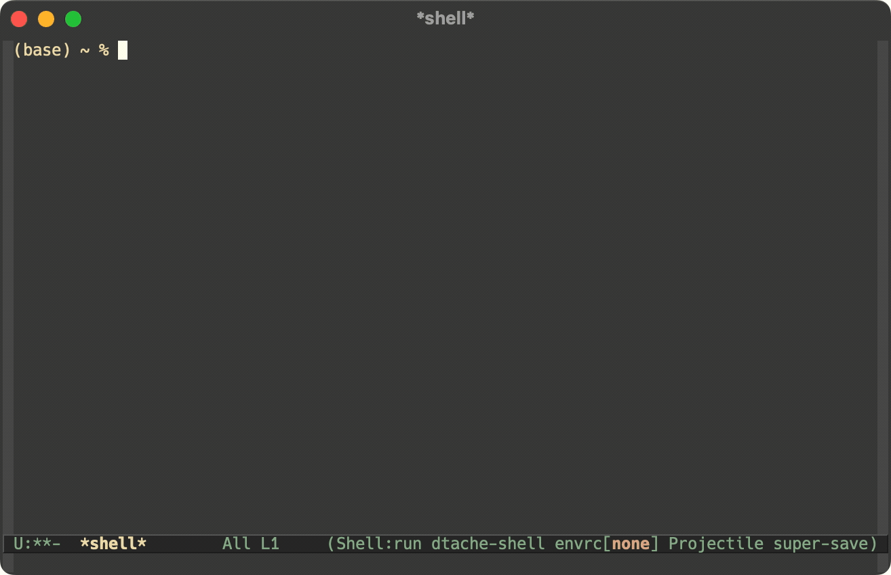

# warped.el

warped.el lets you run actions from the [Warp](https://www.warp.dev/)
terminal in a shell buffer.

# Installation

This project is still a work in progress.

# Usage

Firstly, the custom variable `warped-workspace-root` must be set to
the workflow specs directory.  This would be for example the directory
[here](https://github.com/warpdotdev/Workflows/tree/main/specs) in the
warpdotdev/Workflows.

To insert an action, you can simply run the command <kbd>M-x
warped-action</kbd>.

When editing an action there are two special key bindings:

- <kbd>TAB</kbd> Switch to the next item to be edited.
- <kbd>C-c C-c</kbd> End action template editing.
